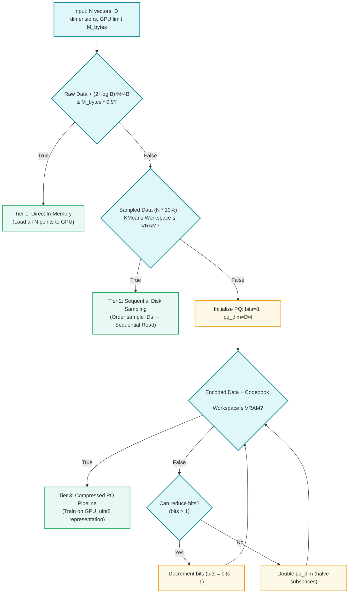
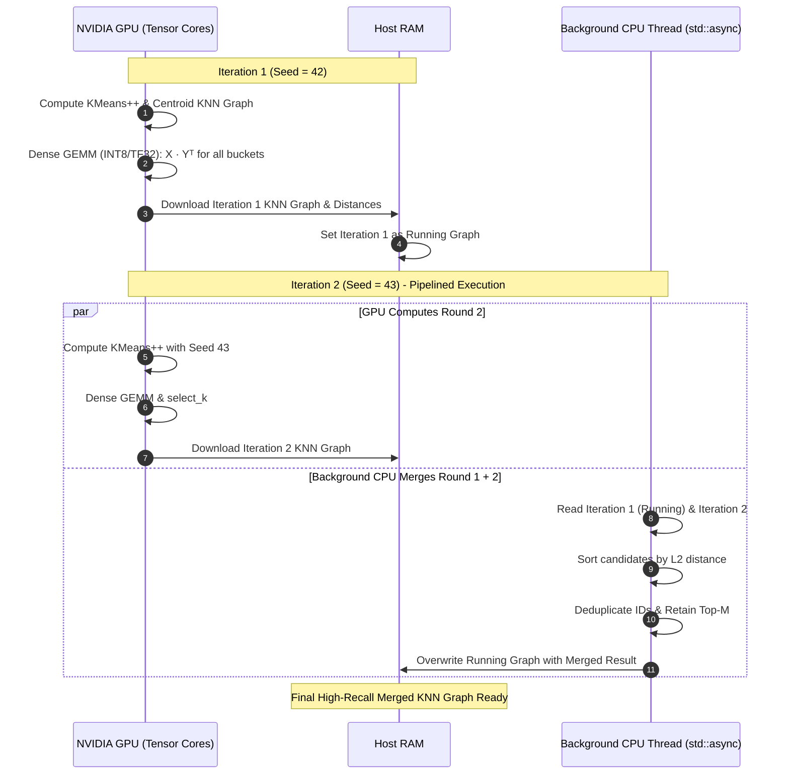
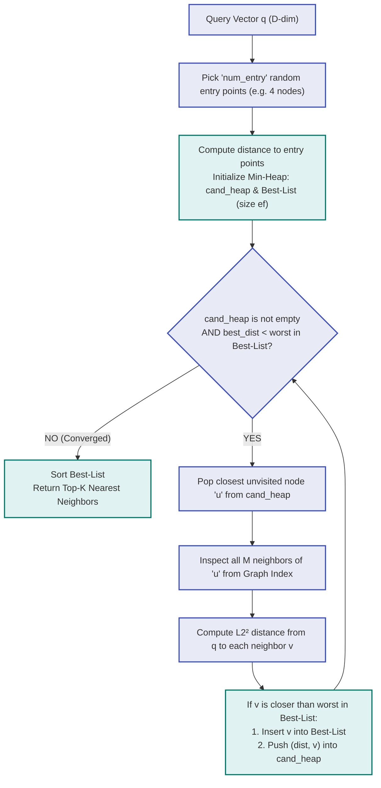

# GPANN: System Architecture & Flowcharts

This document visualizes the complete end-to-end pipeline of the **GPU-tailored-ANN (GPANN)** framework.

---

## 1. Master End-to-End Architecture Flowchart

```mermaid
flowchart TD
    classDef io fill:#e1f5fe,stroke:#0288d1,stroke-width:2px,color:#01579b;
    classDef decision fill:#fff3e0,stroke:#f57c00,stroke-width:2px,color:#e65100;
    classDef gpu fill:#e8f5e9,stroke:#388e3c,stroke-width:2px,color:#1b5e20;
    classDef cpu fill:#ede7f6,stroke:#512da8,stroke-width:2px,color:#311b92;
    classDef out fill:#fce4ec,stroke:#c2185b,stroke-width:2px,color:#880e4f;

    START(["Raw Vector Dataset<br/>(.fbin / .u8bin / .ibin)"]):::io --> S1

    subgraph PHASE1 ["Phase 1: Memory-Adaptive Ingestion"]
        S1{"Does Full Dataset +<br/>KMeans Workspace<br/>Fit in GPU VRAM?"}:::decision
        S1 -- "YES" --> L1["Full Dataset In-Memory Load"]:::gpu
        S1 -- "NO" --> S2{"Does Sampled Subset<br/>(e.g., 10%) Fit in VRAM?"}:::decision
        S2 -- "YES" --> L2["Sequential Disk Sampling<br/>(Sorted NVMe I/O)"]:::io
        S2 -- "NO" --> L3["Adaptive Subspace PQ<br/>(Dynamically compress to 8-1 bits)"]:::gpu
    end

    L1 & L2 & L3 --> S3

    subgraph PHASE2 ["Phase 2: Centroid Backbone Construction"]
        S3["Parallel GPU KMeans++<br/>(Sample B ≈ N/32 centroids)"]:::gpu --> S4["Centroid KNN Graph Build<br/>(RAFT CAGRA graph on centroids)"]:::gpu
    end

    S4 --> S5

    subgraph PHASE3 ["Phase 3: Vector Assignment to Voronoi Buckets"]
        S5["Stream Dataset in GPU Batches"]:::gpu --> S6["GPU Greedy Graph ANNS<br/>(Route each vector to nearest centroid)"]:::gpu
        S6 --> S7["Top-2 Boundary Rebalance<br/>(Balance bucket size to 32 ± slack)"]:::cpu
    end

    S7 --> S8

    subgraph PHASE4 ["Phase 4: Tensor Core Per-Vector KNN"]
        S8["Gather Candidate Vectors<br/>(Self-bucket + K centroid neighbor buckets)"]:::gpu --> S9["Compute Pairwise L2 Distance<br/>via cuBLAS Tensor Core GEMM<br/>(INT8 IMMA / FP32 TF32)"]:::gpu
        S9 --> S10["GPU select_k<br/>(Extract top-M nearest neighbors)"]:::gpu
    end

    S10 --> S11

    subgraph PHASE5 ["Phase 5: Multi-Iteration Overlapped Merge"]
        S11{"Iteration t < T?"}:::decision
        S11 -- "YES (t < T)" --> S12["Async CPU Dedupe-Merge<br/>(Overlapped via std::async)"]:::cpu
        S12 -. "Runs in background while GPU starts next round" .-> S3
        S11 -- "NO (Done T rounds)" --> S13["Consolidated Forward KNN Graph"]:::io
    end

    S13 --> S14

    subgraph PHASE6 ["Phase 6: Out-of-Core Graph Optimization"]
        S14["Bucket ID Reordering<br/>(Consecutive ID mapping [Ob, Ob+1))"]:::cpu --> S15["3-Slot Sliding-Window GPU Inversion<br/>(Reverse edges without OOM)"]:::gpu
        S15 --> S16["CAGRA Detour Occlusion Pruning<br/>(Target degree K_out)"]:::gpu
    end

    S16 --> FINAL(["Final High-Recall Graph Index<br/>(cagra_graph.bin / neighbors.npy)"]):::out
```

---

## 2. Adaptive Memory Decision Tree

---

## 3. Tensor Core GEMM & Asynchronous Merge Pipeline

---

## 4. Online Query Search Pipeline

